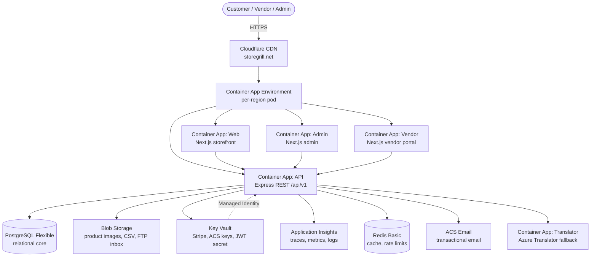

# StoreGrill Architecture

## System diagram



## Component responsibilities

| Component | Responsibility |
|---|---|
| **Container App: API** | Express REST API — product catalog, cart, checkout, orders, payments, vendors, deals, search, translations, imports |
| **Container App: Web** | Next.js customer storefront — SSR product pages, SEO, region-aware routing, RTL support |
| **Container App: Admin** | Next.js admin dashboard — order management, vendor approvals, analytics, content moderation |
| **Container App: Vendor** | Next.js vendor portal — product CRUD, order fulfillment, returns, payouts |
| **Container App: Translator** | Azure Translator fallback for i18n when LibreTranslate is unavailable |
| **PostgreSQL Flexible** | Single source of truth — region, product, order, vendor, deal, payout, cart, review tables |
| **Blob Storage** | Product images, CSV imports, FTP inbox |
| **Key Vault** | Secrets: Stripe keys, ACS connection string, JWT secret, PayPal credentials |
| **Redis Basic** | In-memory cache, rate limiting, session store |
| **Application Insights** | Distributed tracing, custom metrics, structured logs |
| **Blob Storage** | `products/` (images), `imports/` (CSV, feeds, staged files), `ftp-inbox/` (SFTP landing share) |
| **Key Vault** | All secrets; encrypted vendor FTP credentials with managed-identity access |
| **Front Door** | Global entry for storegrill.net, region → nearest origin, caching, TLS |
| **Application Insights** | Observability: request telemetry, dependency tracing, custom events (import success/fail) |

## Region model

Region drives behavior; there is **no region branching in code**.

- Per-region config: `languages[]`, `currencies[]` + `defaultCurrency`, `defaultTimezone`, `taxRules[]`, `shippingZones[]`, `deals` (region-scoped), `freeShippingThresholdMinorUnits`.
- Price is computed server-side: `regionalPrice = basePriceMinorUnits * regionalMultiplier` then tax and deal rules apply.
- Currency stored as `{ amountMinorUnits: bigint, currencyCode: string }` — conversion happens server-side only.

## Request flow (customer purchase)

1. Browser → Front Door (`storegrill.net`) → nearest App Service origin.
2. API: cart total recalculated server-side (unit prices per region × qty + tax + shipping − deals/coupons).
3. Payment tokenized (Stripe/PayPal/COD), order created, inventory reserved.
4. Functions pick up order events: confirmation email, payout ledger, shipment events, analytics.

## Import pipeline (vendor → catalog)

```
CSV upload / Import URL / FTP-SFTP
   → validate (schema, SKU, price, currency)
   → normalize (units, dedupe by SKU+vendor)
   → dry-run preview (diff vs current catalog)
   → staged apply
   → notify vendor (email + dashboard)
   → audit log entry
```

Result job rows tracked in `ImportJob` / `ImportJobResult` with row-level errors surfaced in the vendor dashboard.

## Cost posture (Azure free)

| Item | Free allowance | Flag |
|---|---|---|
| App Service F1 | 60 CPU-min/day | default |
| Functions Consumption | 1M executions/mo | default |
| SQL Database Free | 1 DB, 100k vCore-sec/mo | default |
| Blob Storage | 5 GB | default |
| App Insights | 5 GB/mo | default |
| ACS Email | PAYG ~$0.25 per 1k emails; custom-domain quota 100/h raisable free | flag — tiny cost, Azure-only |
| Front Door Standard | no free tier | `deployFrontDoor` (off) |
| Redis Basic | no free tier | `deployRedis` (off) |

## Local development parity

`docker compose up` mirrors production services 1:1:

| Azure | Local |
|---|---|
| Blob Storage | MinIO (`localhost:9000`, console `:9001`) |
| SQL Database | PostgreSQL 16 (`localhost:5432`) |
| ACS Email | Mailpit (`localhost:1025`, UI `:8025`) |
| Redis | Redis 7 (`localhost:6379`) |
| Key Vault | `.env` (gitignored) |

